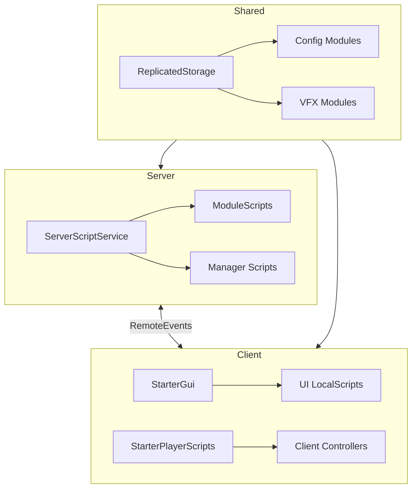

# 🏗️ Technical Architecture

Arsitektur sistem dan manajemen backend.

## Architecture Pattern

- **Pattern:** Service-Manager
- **Style:** Modular, Event-Driven
- **Language:** Luau (Roblox)



## Key Modules

### Server Core (ServerScriptService)

| Module | Purpose |
|:-------|:--------|
| `GameManager.server.luau` | Main game loop, wave control |
| `WeaponManager.server.luau` | Weapon handling, damage calculation |
| `KnockManager.server.luau` | Player knocked/revive system |
| `LobbyRoomManager.server.luau` | Room creation & matchmaking |
| `LobbyManager.server.luau` | Lobby initialization & remotes |
| `RandomWeaponManager.server.luau` | Mystery box weapon purchases |

### Server Modules (ModuleScript)

| Module | Purpose |
|:-------|:--------|
| `DataStoreManager.luau` | Player data persistence (ProfileStore) |
| `InventoryManager.luau` | Centralized inventory operations |
| `ZombieModule.luau` | Enemy AI & spawning |
| `MissionManager.luau` | Daily/Weekly mission system |
| `AchievementManager.luau` | Achievement tracking |
| `StatsModule.luau` | Player stats & leaderboards |
| `PerkModule.luau` | In-game perk system |
| `SkillModule.luau` | Player skill tree |
| `BoosterModule.luau` | Field Kit management |
| `ElementConfigModule.luau` | Tactical Boosts (formerly Elements) |
| `CoinsModule.luau` | Currency management |
| `TitleManager.luau` | Player title system |
| `GachaModule.luau` | Gacha/lootbox system |
| `APShopManager.luau` | Achievement Points shop |
| `MPShopManager.luau` | Mission Points shop |

### Shared Config (ReplicatedStorage)

| Module | Purpose |
|:-------|:--------|
| `WeaponModule.luau` | Weapon definitions & stats |
| `ZombieConfig.luau` | Enemy settings |
| `PerkConfig.luau` | Perk definitions |
| `SkillConfig.luau` | Skill tree definitions |
| `MissionConfig.luau` | Mission templates |
| `DialogueConfig.luau` | NPC dialogues |

### Client Controllers (StarterPlayerScripts)

| Module | Purpose |
|:-------|:--------|
| `WeaponClient.local.luau` | Client-side weapon handling |
| `TrueFPSController.local.luau` | First-person camera |
| `MobileControlsClient.local.luau` | Touch controls |

## Networking Pattern

```lua
-- Client → Server (Action)
RemoteEvent:FireServer(action, data)

-- Server → Client (Update)
RemoteEvent:FireClient(player, data)

-- Request/Response
RemoteFunction:InvokeServer(request)
```

## Code Standards

- Gunakan `GetService` di awal script sekali
- Selalu gunakan `:WaitForChild()` untuk akses UI
- Validasi tipe data di server untuk RemoteEvents
- Gunakan `tonumber()` untuk data konfigurasi
- PlaceId Guard di awal script untuk multi-place games:
  ```lua
  local LOBBY_PLACE_ID = 101319079083908
  if game.PlaceId ~= LOBBY_PLACE_ID then return end
  ```
