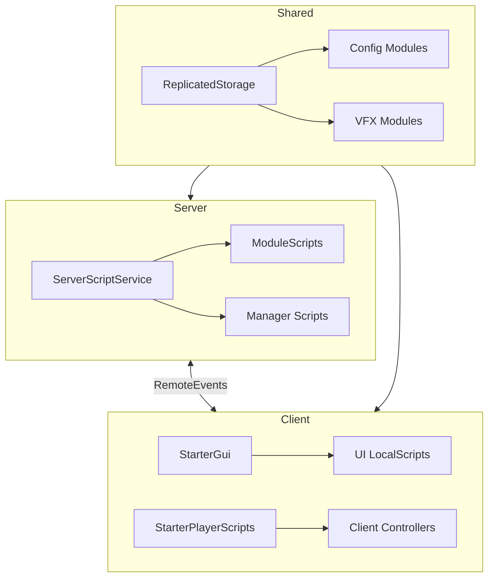

# 🏗️ Technical Architecture

Arsitektur sistem dan manajemen backend.

## Architecture Pattern

- **Pattern:** Service-Manager
- **Style:** Modular, Event-Driven
- **Language:** Luau (Roblox)



## Key Modules

### Server Core
| Module | Purpose |
|:-------|:--------|
| `GameManager.lua` | Main game loop, wave control |
| `WeaponManager.lua` | Weapon handling, damage |
| `DataStoreManager.lua` | Player data persistence |
| `ZombieModule.lua` | Enemy AI & spawning |

### Shared Config
| Module | Purpose |
|:-------|:--------|
| `WeaponModule.lua` | Weapon definitions |
| `GameConfig.lua` | Game settings |
| `ZombieConfig.lua` | Enemy settings |

## Networking Pattern

```lua
-- Client → Server (Action)
RemoteEvent:FireServer(action, data)

-- Server → Client (Update)
RemoteEvent:FireClient(player, data)

-- Request/Response
RemoteFunction:InvokeServer(request)
```

## Code Standards

- Gunakan `GetService` di awal script sekali
- Selalu gunakan `:WaitForChild()` untuk akses UI
- Validasi tipe data di server untuk RemoteEvents
- Gunakan `tonumber()` untuk data konfigurasi
